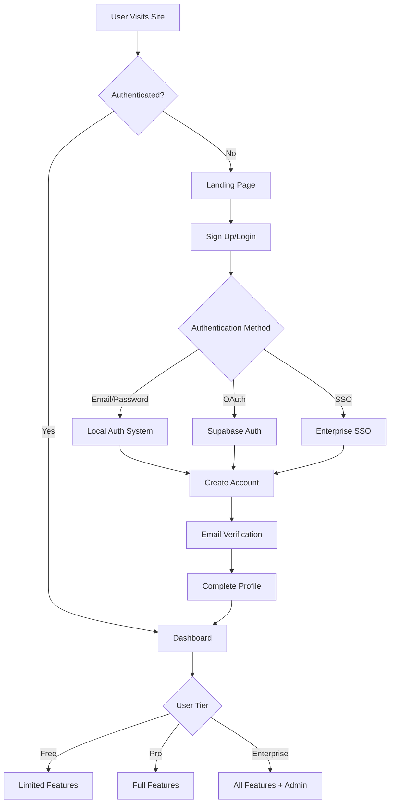
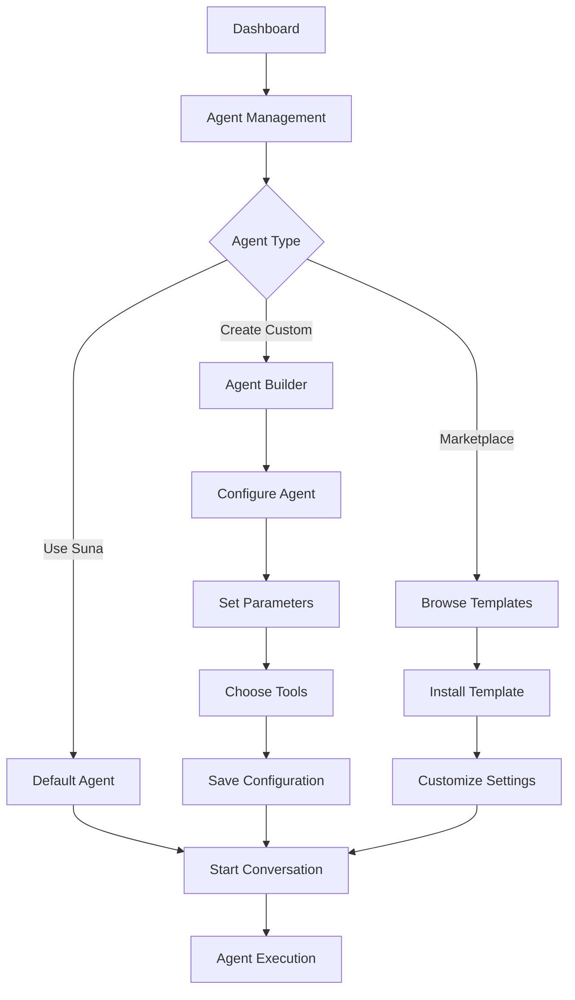
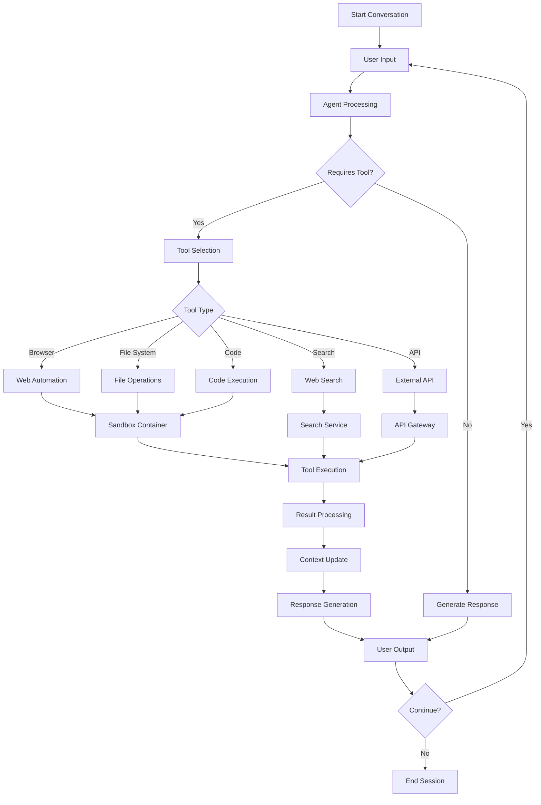
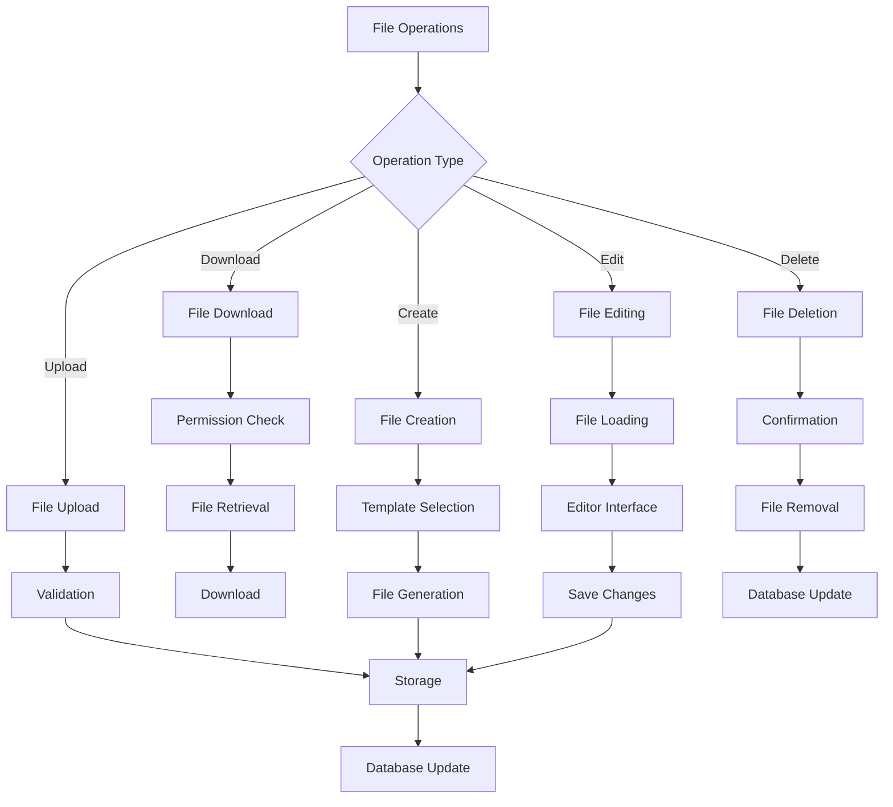
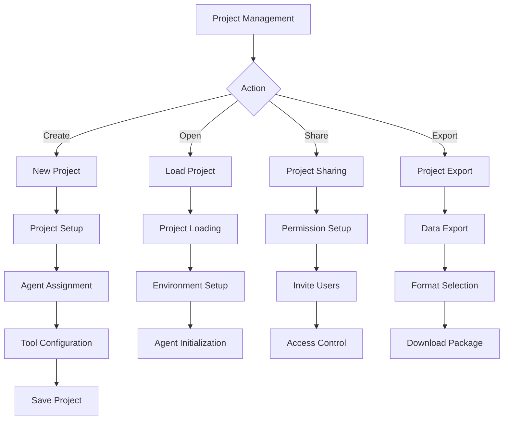
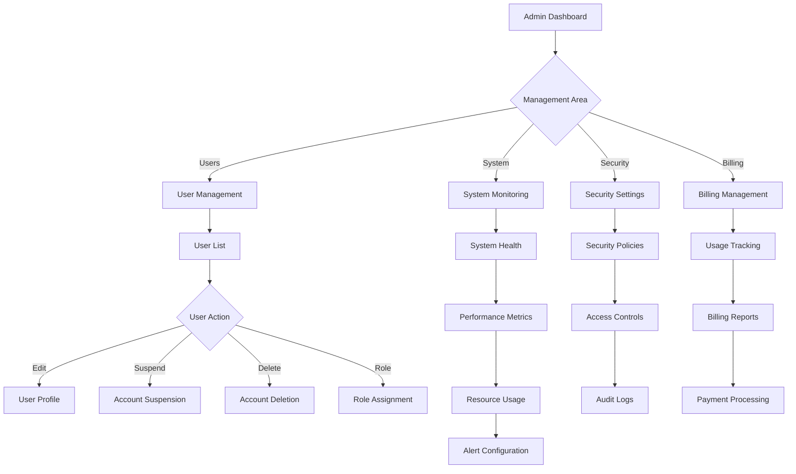
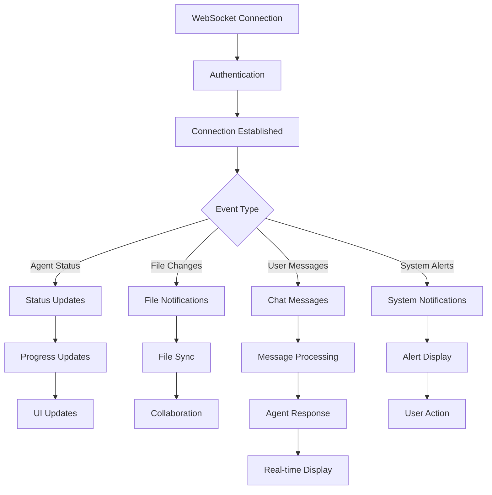
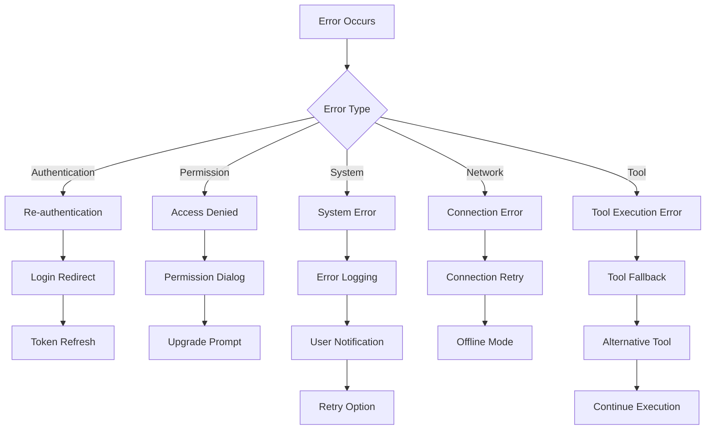
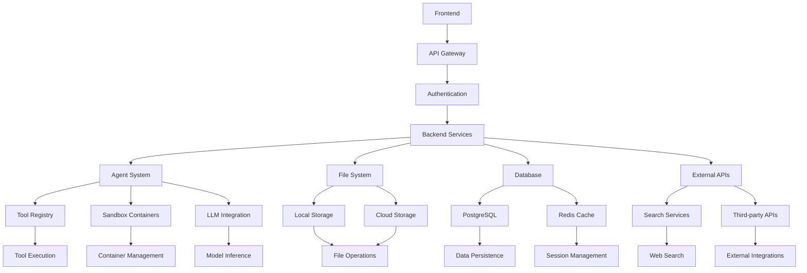
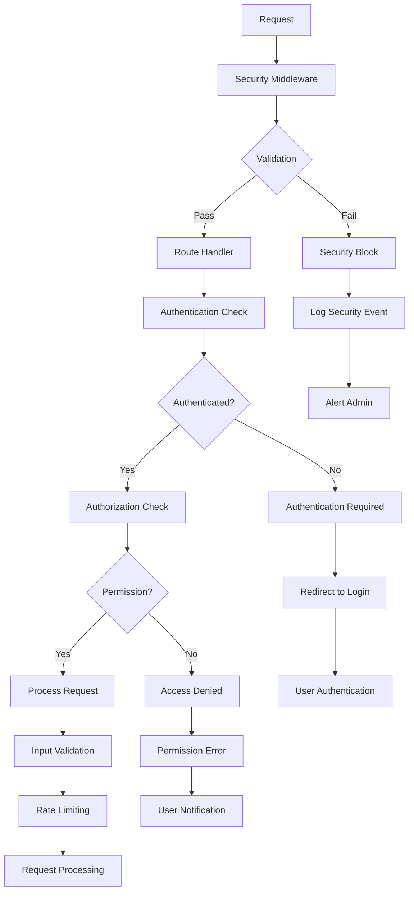

# Suna AI Worker - User Process Flow Diagram

## Overview
This document outlines the complete user journey and process flows for the Suna AI Worker platform, from initial access through agent execution and management.

## 1. User Authentication Flow

## 2. Agent Management Flow

## 3. Agent Execution Flow

## 4. File Management Flow

## 5. Project Management Flow

## 6. Admin Management Flow

## 7. Real-time Communication Flow

## 8. Error Handling Flow

## 9. Data Flow Architecture

## 10. Security Flow

## Key Features Summary

### Core Capabilities
- **Multi-modal AI Agent**: Text, vision, code execution, file operations
- **Browser Automation**: Web scraping, form filling, navigation
- **File Management**: Create, edit, organize documents and code
- **Real-time Collaboration**: WebSocket-based live updates
- **Tool Integration**: Extensive tool ecosystem with MCP support
- **Sandbox Execution**: Secure containerized agent runtime

### User Experience
- **Intuitive Interface**: Modern React-based dashboard
- **Responsive Design**: Works across all devices
- **Real-time Updates**: Live progress and status updates
- **Error Handling**: Graceful error recovery and user guidance
- **Accessibility**: WCAG compliant interface

### Security Features
- **Multi-layer Security**: Network, application, and data security
- **Role-based Access**: Granular permission system
- **Secure Execution**: Isolated container environments
- **Audit Logging**: Comprehensive activity tracking
- **Data Encryption**: At-rest and in-transit encryption

### Scalability
- **Microservices Architecture**: Modular service design
- **Container Orchestration**: Docker-based deployment
- **Database Optimization**: Connection pooling and indexing
- **Caching Strategy**: Redis-based performance optimization
- **Load Balancing**: Horizontal scaling support

---

*This flow diagram represents the comprehensive user journey through the Suna AI Worker platform, covering all major interactions and system processes.*

